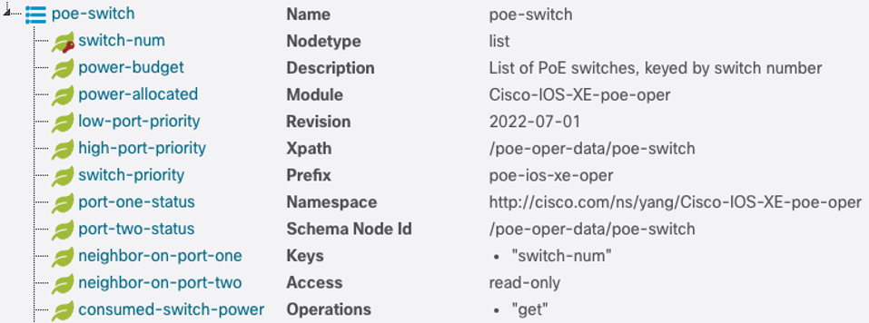
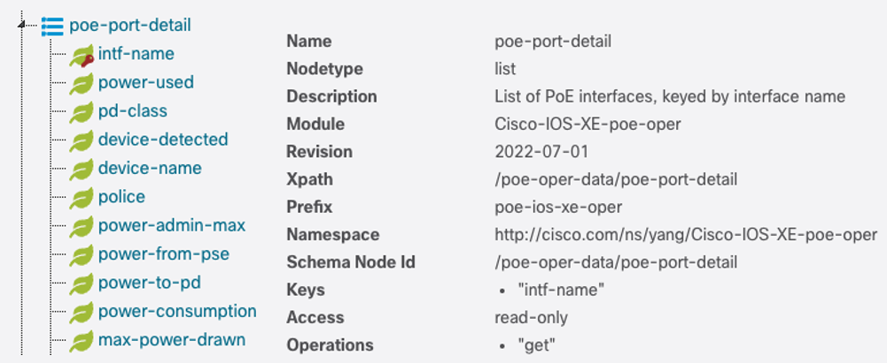
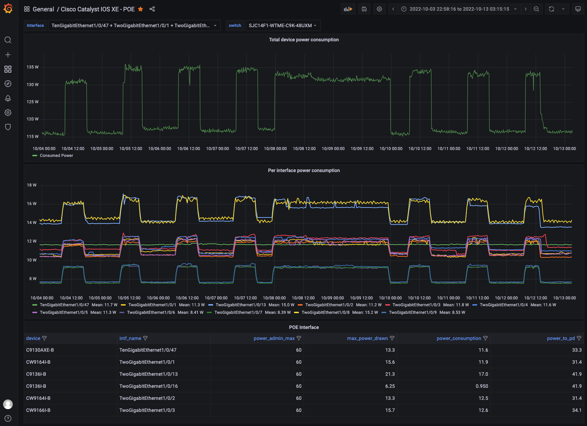
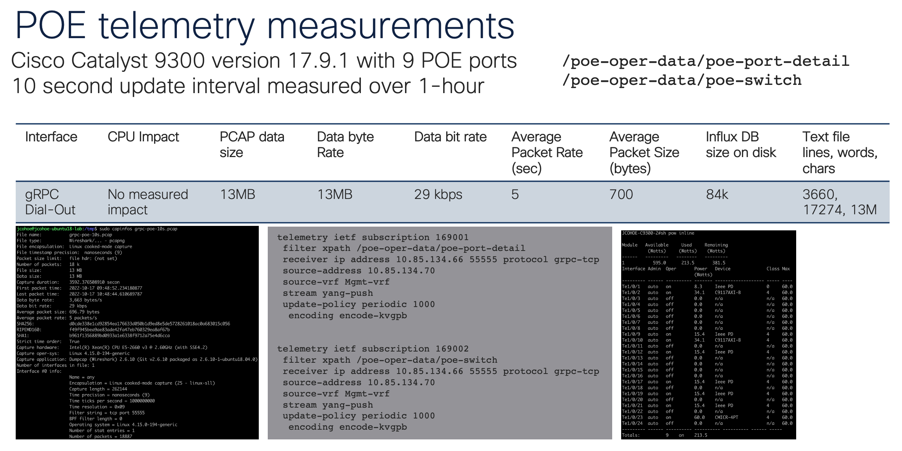

# Cisco Catalyst POE 

Details about monitoring the POE and power consumption and utilization on Cisco Catalyst IOS XE. 

This use case relies on the TIG_MDT Docker container which has the Telegraf, InfluxDB, and Grafana toolset available from [The cisco-ios-xe-mdt repository](https://github.com/jeremycohoe/cisco-ios-xe-mdt/) on Github


# Prerequisites

You need Cisco Catalyst 9300 POE 

Some POE devices connected too

Minimum IOS XE Software release: _____ ?


# POE YANG

The YANG module that has details about Power Over Etherner operational data is the [Cisco-IOS-XE-poe-oper.YANG](https://github.com/YangModels/yang/blob/main/vendor/cisco/xe/1791/Cisco-IOS-XE-poe-oper.yang) which has contains a lot of information about the feature.

There are two specific containers that have data that is relevant to POE and power monitoring: **poe-switch** which models port specific details, and the **poe-port-detail** container which models device level power information.

The **poe-switch** container has ...



The **poe-port-detail** has ...



# Telegraf configuration
Follow the details in the [cisco-ios-xe-mdt](https://github.com/jeremycohoe/cisco-ios-xe-mdt/blob/master/telegraf-grpc.cfg) repository

The telegraf configuration file is **telegraf-grpc.conf** and has two main sections in addition to the agent details

```
[agent]
  hostname = "jcohoe-ubuntu"
  flush_interval = "15s"
  interval = "15s"

[[inputs.cisco_telemetry_mdt]]
  transport = "grpc"
  service_address = ":57500"

[[outputs.influxdb]]
  database = "mdt_grpc"
  urls = [ "http://127.0.0.1:8086" ]
```

Start up telegraf with

```
telegraf -config ./telegraf-grpc.conf
```


# Telemetry Configuration

The CLI config below is used publish the POE telemetry data.

Replace the receiver IP address and port with your Telegraf server IP and port where the listener has been enabled. In this example port 57500 is used on both the Telegraf input where the port is listening for telemetry from the Cisco IOS XE which is also sending to the same port.

Replace source-address with the correct source IP address

Specify the "source-vrf" if source-address is within the VRF

The peroidic update policy is set for 30 seconds

## CLI configuration example

```
telemetry ietf subscription 169001
 filter xpath /poe-oper-data/poe-port-detail
 receiver ip address 10.85.134.66 57500 protocol grpc-tcp
 source-address 10.85.134.70
 source-vrf Mgmt-vrf
 stream yang-push
 update-policy periodic 3000
  encoding encode-kvgpb


telemetry ietf subscription 169002
 filter xpath /poe-oper-data/poe-switch
 receiver ip address 10.85.134.66 57500 protocol grpc-tcp
 source-address 10.85.134.70
 source-vrf Mgmt-vrf
 stream yang-push
 update-policy periodic 3000
  encoding encode-kvgpb
```

## Telemetry configuraiton with Python + NETCONF

Please add example on how to add the 2 subs with Python 

## Telemetry configuraiton with Ansible + RESTCONF

Please add example :)

# Embedded Event Manager (EEM) Applet to control POE

The below 2 EEM Applets can be installed into the CLI running-configuration to automatically enable or disable POE power to the ports according to the timed schedule

```
! EEM POE example SelectivePowerOff
no event manager applet SelectivePowerOff
event manager applet SelectivePowerOff
! Turn *OFF* POE power to the ports daily at 9PM: 0 21 * * *
event timer cron name SelectivePowerOff cron-entry "0 21 * * *"
! or
! event none
!
 action 0.0 cli command "enable"
 action 0.1 cli command "show power inline"
 action 0.2 foreach line "$_cli_result" "\n"
 action 1.1  regexp "^([^[:space:]]*)[[:space:]]*[^[:space:]]*[[:space:]]*on.*$" "$line" temp interface
 action 1.2  if $_regexp_result eq 1
 action 1.3   cli command "conf t"
 action 1.4   cli command "interface $interface"
 action 1.5   cli command "power inline never"
 action 1.6   syslog msg "Turned off PoE on $interface"
 action 1.7  end
 action 2.1 end
```

Similar EEM Applet to power on the ports at some timed schedule

```
! EEM POE example SelectivePowerOn
event manager applet SelectivePowerOn
! Turn **ON** POE power to the ports daily at 6AM: 0 6 * * *
event timer cron name SelectivePowerOn cron-entry "0 6 * * *"
!
! or
!event none
 action 0.0 cli command "enable"
 action 0.1 cli command "show power inline"
 action 0.2 foreach line "$_cli_result" "\n"
 action 1.1  regexp "^([^[:space:]]*)[[:space:]]*off.*$" "$line" temp interface
 action 1.2  if $_regexp_result eq 1
 action 1.3   cli command "conf t"
 action 1.4   cli command "interface $interface"
 action 1.5   cli command "power inline auto"
 action 1.6   syslog msg "Turned on PoE on $interface"
 action 1.7  end
 action 2.1 end
```


# Grafana dashboard #17238

See details about the [Cisco Catalyst POE Dashboard #17238 on Grafana.com](https://github.com/jeremycohoe/cisco-ios-xe-mdt/blob/master/telegraf-grpc.cfg)

A simple and example dashboard has been provided to visualize the POE telemetry data over time.

This dashboard can be copied into any existing Grafana instance by importing the Dashboard ID from Grafana.com dashboard repository, or, by importing the **Cisco_Catalyst_POE_Dashboard.json** file as part of this repository




# Data utilization

When enabling the Model Driven Telemetry some considerations are the amount of data transmitted over the network as well as the amount of data that needs to be stored and processed. The following chart is provided to help understand the cost of the telemtry to the network device, over the network or WAN links, and the amount of disk needed.

In this example the two containers and xpaths were collected at a **10 second update interval** for the duration of 1 hour/60 minutes. After the 1 hour the amount of data transmitted from the Cisco device to the telegraf collect was around 13 MB, at at rate of about 29 kbps, with an average of 5 packets per second sized around 700 bytes. The data when stored in an InfluxDB is around 84k and if stored into a flat non-compressed text file is around 3600 lines, 17000 words, and around 13MB of disk space. 



# TO DO
Post dashboard to Grafana.com and share ID

Post dashboard JSON to Github too

# IOS XE support for Cisco-IOS-XE-poe-oper.YANG
Which IOS XE release do we first see support for the 7 leaf / 2 containers needed for this usecase ?

With the initial release of Cisco IOS XE version **16.9** the POE Operational YANG data module was added and since has received several updates as new features and data points were added,


```
jcohoe@JCOHOE-M-C6NA xe % pwd
/Users/jcohoe/yang/vendor/cisco/xe
jcohoe@JCOHOE-M-C6NA xe % find . |grep poe-oper |grep -v "YANG_1.1" |grep -v cedge | sort
./16101/Cisco-IOS-XE-poe-oper.yang
./16111/Cisco-IOS-XE-poe-oper.yang
./16121/Cisco-IOS-XE-poe-oper.yang
./1691/Cisco-IOS-XE-poe-oper.yang
./1693/Cisco-IOS-XE-poe-oper.yang
./17101/Cisco-IOS-XE-poe-oper.yang
./1711/Cisco-IOS-XE-poe-oper.yang
./1721/Cisco-IOS-XE-poe-oper.yang
./1731/Cisco-IOS-XE-poe-oper.yang
./1741/Cisco-IOS-XE-poe-oper.yang
./1751/Cisco-IOS-XE-poe-oper.yang
./1761/Cisco-IOS-XE-poe-oper.yang
./1771/Cisco-IOS-XE-poe-oper.yang
./1781/Cisco-IOS-XE-poe-oper.yang
./1791/Cisco-IOS-XE-poe-oper.yang
```
